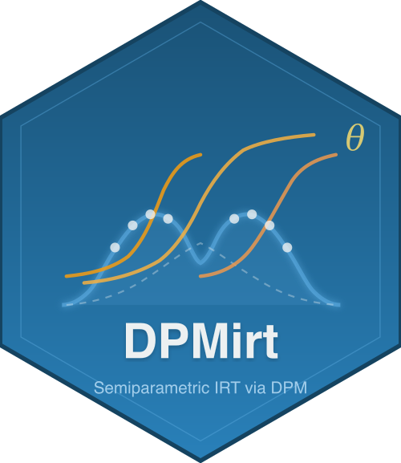

# DPMirt 

<!-- badges: start -->
[](https://github.com/joonho112/DPMirt)
[](https://opensource.org/licenses/MIT)
<!-- badges: end -->

**Bayesian Semiparametric Item Response Theory Models Using Dirichlet
Process Mixture Priors**

DPMirt fits Bayesian IRT models with flexible, nonparametric ability
distributions via [NIMBLE](https://r-nimble.org/).  It supports Rasch,
2PL, and 3PL models under both a standard Normal prior and a Dirichlet
Process Mixture (DPM) prior, and provides three posterior summary methods
— PM, CB, and GR — designed for different inferential goals.

## Key Features

| Feature | Description |
|:--------|:------------|
| **Three IRT models** | Rasch, 2PL, and 3PL |
| **Two latent priors** | Parametric (Normal) and semiparametric (DPM) |
| **Triple-goal estimation** | Posterior Mean (PM), Constrained Bayes (CB; Ghosh 1992), Triple-Goal (GR; Shen & Louis 1998) |
| **Compile-once workflow** | Compile the NIMBLE model once, then draw additional sequential samples while the compiled object is live |
| **Principled prior elicitation** | Optional concentration-parameter calibration via [DPprior](https://github.com/joonho112/DPprior), with a Gamma(1, 3) fallback |
| **Reliability-targeted simulation** | Generate Rasch/2PL test data at a specified marginal reliability via [IRTsimrel](https://github.com/joonho112/IRTsimrel); 3PL uses DPMirt's fallback simulator and does not target reliability |
| **Rich diagnostics** | ESS, optional chain-aware R-hat, WAIC provenance, posterior predictive checks, trace and density plots |

## Installation

Install the development version from GitHub:

```r
# install.packages("remotes")
remotes::install_github("joonho112/DPMirt")
```

DPMirt requires **R ≥ 4.1** and **nimble ≥ 1.0.0**.  NIMBLE needs a
working C++ compiler; see the
[NIMBLE installation guide](https://r-nimble.org/download) if you do
not already have one set up.

### Optional packages

`DPprior` and `IRTsimrel` are optional GitHub packages. DPMirt installs and
runs without them: without `DPprior`, alpha-prior elicitation falls back to
`Gamma(1, 3)`; without `IRTsimrel`, simulation uses DPMirt's internal
fallback generator without reliability targeting.

```r
# Principled alpha prior elicitation
remotes::install_github("joonho112/DPprior")

# Reliability-targeted simulation
remotes::install_github("joonho112/IRTsimrel")

# Enhanced plotting
install.packages(c("ggplot2", "bayesplot"))
```

## Quick Start

```r
library(DPMirt)

# 1. Simulate a bimodal population (200 persons, 20 items)
sim <- dpmirt_simulate(
  n_persons = 200, n_items = 20,
  model = "rasch", latent_shape = "bimodal",
  target_rho = 0.8, seed = 42
)

# 2. Fit a Rasch model with a DPM prior
fit <- dpmirt(
  sim$response,
  model = "rasch", prior = "dpm",
  niter = 10000, nburnin = 3000, seed = 123
)

# 3. Inspect results
summary(fit)
plot(fit, type = "density")

# 4. Compute triple-goal estimates (PM, CB, GR)
est <- dpmirt_estimates(fit)
plot(est, type = "shrinkage")

# 5. Compare Normal vs DPM priors
fit_normal <- dpmirt(
  sim$response,
  model = "rasch", prior = "normal",
  niter = 10000, nburnin = 3000, seed = 123
)
dpmirt_compare(fit_normal, fit)
```

## Step-by-Step Pipeline

For finer control, use the modular pipeline instead of the all-in-one
`dpmirt()` wrapper:

```r
# Specify
spec <- dpmirt_spec(sim$response, model = "2pl", prior = "dpm")

# Compile (slow — only done once)
compiled <- dpmirt_compile(spec)

# Sample
samples <- dpmirt_sample(compiled, niter = 10000, nburnin = 3000)

# Rescale (post-hoc identification)
fit <- dpmirt_rescale(samples)

# Continue sampling without recompiling
resumed <- dpmirt_resume(fit, niter_more = 5000)
fit2 <- dpmirt_rescale(resumed)
```

Compiled NIMBLE objects contain external pointers and cannot be restored from
RDS. `dpmirt_resume()` therefore requires the original live compiled object
stored in the `dpmirt_samples` or `dpmirt_fit` object.

## Posterior Summary Methods

DPMirt implements three complementary estimators for person abilities:

- **PM (Posterior Mean)** — minimises individual-level mean squared
  error but can severely compress the ability distribution, especially
  when test reliability is low.
- **CB (Constrained Bayes)** — inflates the PM distribution so that
  the first two moments of the estimates match the posterior predictive
  distribution (Ghosh, 1992).
- **GR (Triple-Goal)** — places each estimate at the midpoint of its
  corresponding quantile interval of the estimated empirical
  distribution function, optimising simultaneous estimation, ranking,
  and distributional recovery (Shen & Louis, 1998).

```r
est <- dpmirt_estimates(fit, methods = c("pm", "cb", "gr"))

# Compare estimator distributions against truth
dpmirt_loss(est, true_theta = sim$theta, metrics = c("msel", "ks"))
```

## Diagnostics and Draws

```r
diag <- dpmirt_diagnostics(fit)
diag$chain_info
diag$waic_aggregation

theta_draws <- dpmirt_draws(fit, vars = "theta", format = "long")
head(theta_draws)
```

`dpmirt_fit` objects store chain/run provenance through `schema_version`,
`chain_info`, `draw_index`, and `run_history`. R-hat is reported when at
least two labeled chains have retained draws; single-chain fits and the
compact vignette fixtures return `NULL` R-hat and should be judged with ESS,
trace plots, and substantive diagnostics.

`dpmirt_draws()` currently extracts the rescaled posterior draws used by
summary and plotting methods. Raw, unrescaled draw extraction and disk-backed
draw storage (`save_draws = FALSE` or `save_path`) are reserved for a future
release.

## Current Scope Notes

- `sampler_config` supports an advanced function hook with signature
  `function(conf, model, spec)`. List-based sampler schemas are reserved.
- `item_priors` is reserved; use `NULL` or `list()` for DPMirt's fixed item
  priors.
- 3PL models include item guessing parameters (`delta`). Some identification
  combinations are intentionally unavailable, including `constrained_item`
  for 3PL and `constrained_ability` for DPM models.
- 3PL simulation uses DPMirt's fallback generator with Beta-distributed
  guessing parameters and does not use `target_rho`.
- `dpmirt_dp_density()` can be computationally expensive because it rebuilds
  the NIMBLE DP-measure workflow and loads retained DP draws through public
  `modelValues` accessors; compact vignette fixtures store thinned posterior
  draws and plot-ready DP-density summaries.

## Vignettes

DPMirt ships with eight source vignettes:

| Vignette | Topic |
|:---------|:------|
| `vignette("introduction")` | Package overview and reading guide |
| `vignette("quick-start")` | First model fit in 5 minutes |
| `vignette("models-and-workflow")` | All models, priors, and the step-by-step pipeline |
| `vignette("posterior-summaries")` | PM vs CB vs GR with shrinkage diagnostics |
| `vignette("prior-elicitation")` | Principled DPM hyperprior selection |
| `vignette("simulation-study")` | Replicating the evaluation framework from Lee & Wind |
| `vignette("theory-irt-dpm")` | Mathematical foundations |
| `vignette("nimble-internals")` | Custom samplers and advanced NIMBLE configuration |

## References

- Lee, J. & Wind, S. Targeting toward inferential goals in Bayesian
  Rasch models for estimating person-specific latent traits. *OSF
  Preprint*. <https://doi.org/10.31219/osf.io/qrw4n>
- Paganin, S., Paciorek, C. J., Wehrhahn, C., Rodriguez, A.,
  Rabe-Hesketh, S., & de Valpine, P. (2023). Computational strategies
  and estimation performance with Bayesian semiparametric item response
  theory models. *Journal of Educational and Behavioral Statistics,
  48*(2), 147–188.
- Ghosh, M. (1992). Constrained Bayes estimation with applications.
  *Journal of the American Statistical Association, 87*(418), 533–540.
- Shen, W., & Louis, T. A. (1998). Triple-goal estimates in two-stage
  hierarchical models. *Journal of the Royal Statistical Society:
  Series B, 60*(2), 455–471.

## License

MIT © JoonHo Lee
